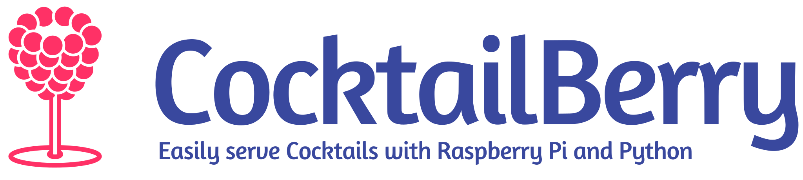

# CocktailBerry Website

This is the repository for the [CocktailBerry](https://docs.cocktailberry.org/) website. The website is built using [next.js](https://nextjs.org/) and [tailwindcss](https://tailwindcss.com/).
It is usually hosted at [cocktailberry.org](https://cocktailberry.org/).

## Development

To run the website locally, you need to have [Node.js](https://nodejs.org/) installed. The project uses [Yarn](https://yarnpkg.com/), which is provided through Node's Corepack (`corepack enable` once). Then, you can clone the repository and install the dependencies:

```bash
git clone https://github.com/AndreWohnsland/CocktailBerry-Website.git
cd cocktailberry-website
yarn install
```

Then, you can run the development server:

```bash
yarn dev
```

This will start the server at [http://localhost:3000](http://localhost:3000). You can then open this URL in your browser to see the website.
